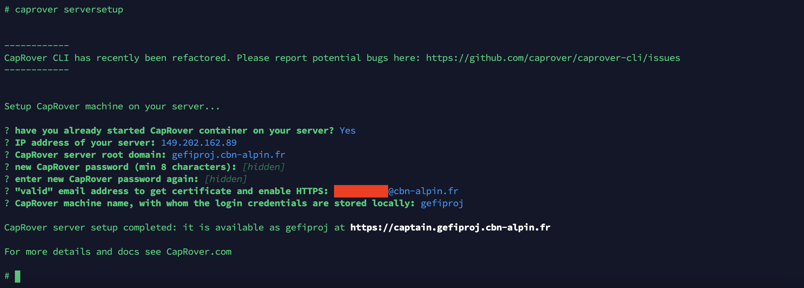
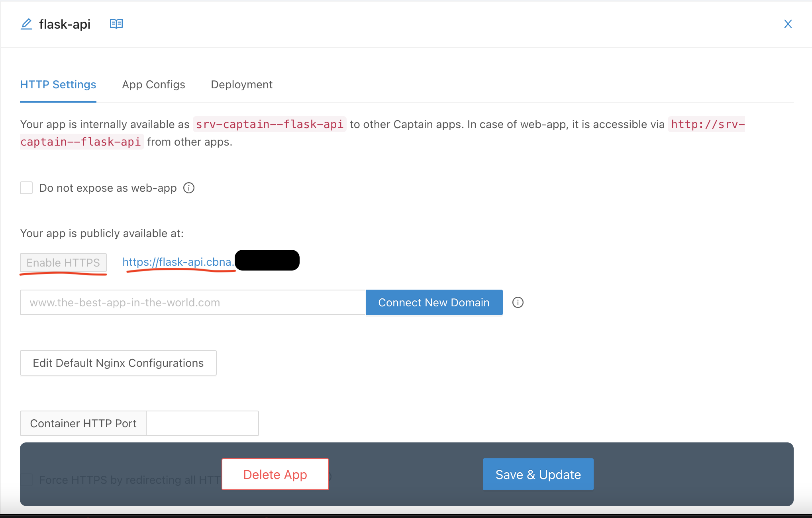
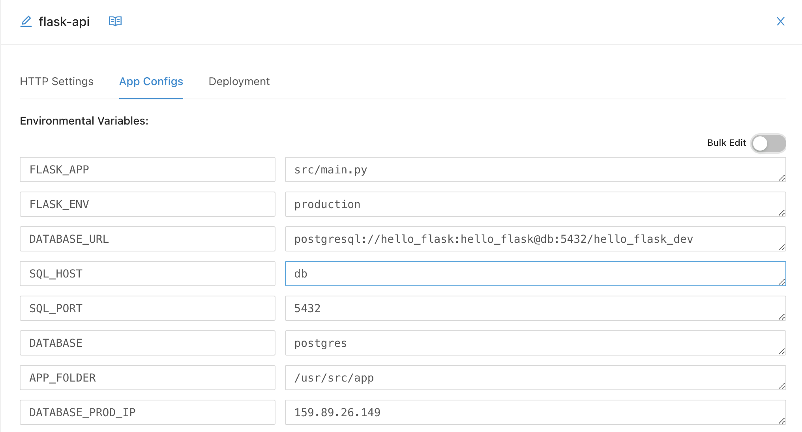
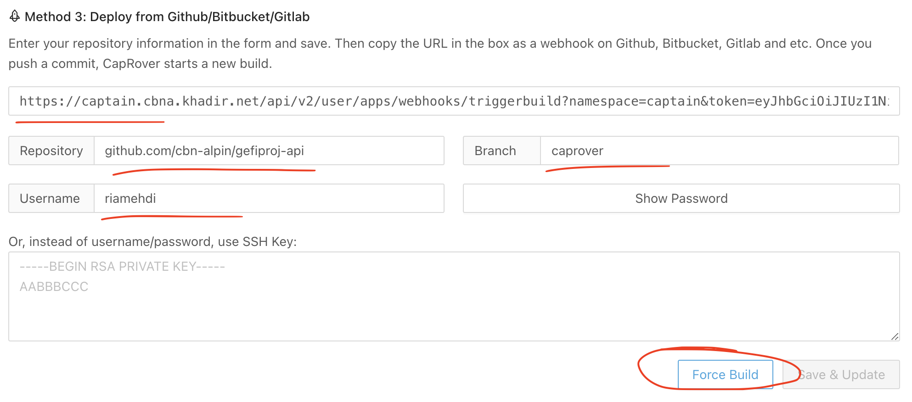

# gefiproj-api
Ce dépôt contient le backend du projet GEFIPROJ. https://gefiproj.cbn-alpin.fr/

## Installation et utilisation
**⚠️ Attention, le projet fonctionne uniquement sous Python v3.x**
 
Pour installer ce projet :
- Cloner le projet dans votre "workspace" local :

```shell
git clone https://github.com/cbn-alpin/gefiproj-api
```

- Se deplacer dans le dossier du projet cloné : 

```shell
cd gefiproj-api/
```

- Créer un environnement virtuel : 
```shell
python -m venv cbna_env
```

- Activer l'environnement virtuel : 
```shell
. ./cbna_env/bin/activate
```

- Installer les dépendances : 
```shell
pip install -r requirements.txt
```

- Configurer l'accès à la base de données : vous devez récupérer le fichier de configurations dans le drive (voir avec votre **administrateur**)
Vous devez enregistrer le fichier `config.yml` dans le fichier `config/` du projet.

- Lancer les tests avec 
```shell
python -m unittest discover -v -s tests/ -p '*_tests.py'
```

**Note importante** ⚠️ ️: Pour lancer les tests il faut avoir configuré l'entrée `test_database` et `test_token` dans le fichier de config 
avec les informations d'une base de donnée autre que celle de la production et un token valide.
 
## Lancement du framwork *Flask* 🚀
- Exporter des variables sur votre terminal : 
    ```shell
    export FLASK_APP=src/main.py
    ```

- Configurer : 
    ```shell
    set FLASK_APP=src/main.py
    ```

- Mode Debug : 
    ```shell
    export FLASK_DEBUG=true
    ```

- Lancer le projet : 
    ```shell
    flask run
    ```

Vérifier que le projet est lancé en allant sur  `/status` et voir que la reponse est `ok`

#  Test Server with Dockerfile
```
cmd=docker build -t cbna_backend:v1 .
docker run -d -p 5000:5000 cbna_backend:v1
```

```bash
#!/bin/bash
awk '{ sub ("\\\\$", " "); printf " --build-arg %s", $0  } END { print ""  }' $@

docker build $(./buildargs.sh .env) -t cbna_backend:v1 .
````


```bash
#!/bin/bash

#docker build "${opts[@]}" -t cbna_backend:v1 .
function create_build_arg {
        awk '{ sub ("\\\\$", " "); printf " --build-arg %s", $0  } END { print ""  }' $@ < .env
}

OUTPUT=$(create_build_arg)
cmd+='docker build'
cmd+=$OUTPUT
cmd+=' -t cbna_backend:v1 .'

eval $cmd
```

# Own Paas serveur with CapRover  🚀
There are many easy CI/CD platforms that offer generous free minutes for your builds, for example GitHub and GitLab both offer free minutes for private repositories and unlimited free minutes for public repositories.
## Prerequisites
    
### Configure Firewall

```bash
sudo ufw allow 80,443,3000,996,7946,4789,2377,5000/tcp; sudo ufw allow 7946,4789,2377/udp;
```

### Step 1: CapRover Installation
```
docker run -p 80:80 -p 443:443 -p 3000:3000 -v /var/run/docker.sock:/var/run/docker.sock -v /captain:/captain caprover/caprover
```

### Step 2: Connect Root Domain

Let's say you own mydomain.com. You can set *.something.mydomain.com as an A-record in your DNS settings to point to the IP address of the server where you installed CapRover. Note that it can take several hours for this change to take into effect. It will show up like this in your DNS configs:

```
*.gefiproj.cbn-alpin.fr
```

- TYPE: A record
- HOST: *.gefiproj.cbn-alpin.fr
- POINTS TO: 149.202.162.89

### Step 3: Install CapRover CLI

```
docker exec -it [DOCKER CONTAINER ID] bash
npm install -g caprover
caprover serversetup
```



Now we can connect to : [https://captain.gefiproj.cbn-alpin.fr/](https://captain.gefiproj.cbn-alpin.fr/)


### Step 4: Install Apps

####  Create and Deploy API Serveur



- When you set the name of app, it's Automatically set as sub-domaine name (`i.e. flask-api.cbna.*`). You change the sub-domaine name in text form and click `Connect New Domain`.
- Don't forgot to click to `Enable HTTPS`

Before start deployment, we have to set the environment variables. Ask your **administrator** for more details.



In `Deployment` tabs we set all GitHub parameters



For this first deployment, we will force build by clicking in `Force Build`. After we will configure the URL generate by CapRover in GitHub /settings/hooks :

`https://captain.cbna.*/api/v2/user/apps/webhooks/triggerbuild?namespace=captain&token=eyJhbGci...`


### Backup

We can backup CapRover configs in order to be able to spin up a clone of this server. Note that your application data (volumes, and images) are not part of this backup.

[More details here](https://caprover.com/docs/get-started.html#step-3-install-caprover-cli)